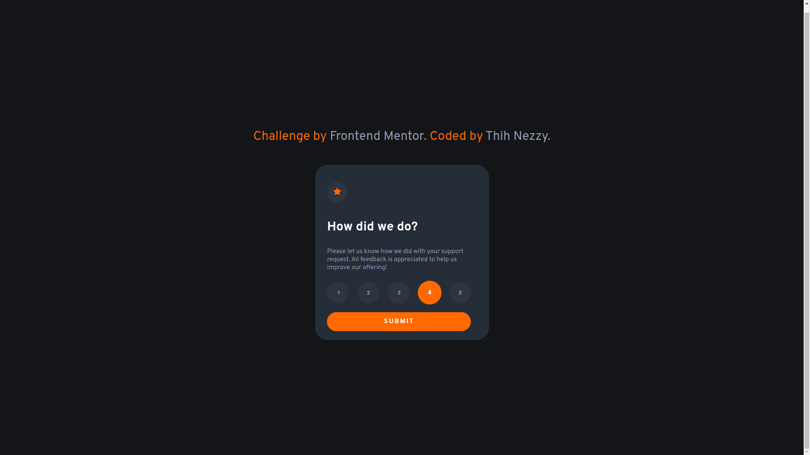

# Frontend Mentor - Interactive rating component solution

This is a solution to the [Interactive rating component challenge on Frontend Mentor](https://www.frontendmentor.io/challenges/interactive-rating-component-koxpeBUmI). Frontend Mentor challenges help you improve your coding skills by building realistic projects.

## Table of contents

- [Frontend Mentor - Interactive rating component solution](#frontend-mentor---interactive-rating-component-solution)
  - [Table of contents](#table-of-contents)
  - [Overview](#overview)
    - [The challenge](#the-challenge)
    - [Screenshot](#screenshot)
    - [Links](#links)
  - [My process](#my-process)
    - [Built with](#built-with)
    - [What I learned](#what-i-learned)
    - [Continued development](#continued-development)
  - [Author](#author)

**Note: Delete this note and update the table of contents based on what sections you keep.**

## Overview

This is the challenge i got from frontend mentor. It helped me a lot to understand more about card design in WebDevelopment. It's also a good tool for me to practice my skills as a beginner

### The challenge

Users should be able to:

- View the optimal layout for the app depending on their device's screen size
- See hover states for all interactive elements on the page
- Select and submit a number rating
- See the "Thank you" card state after submitting a rating

### Screenshot

Index page

Thank you page

### Links

- Solution URL: [Interactive Rating Component](https://nobody1234455.github.io/FE-challeges/html/index.html)

## My process

I download Figma design and did the markdown HTML5 to build the structure for my card. Add properties and styles to elements inside the card.

### Built with

- Semantic HTML5 markup
- CSS custom properties
- Flexbox
- JS
- Hosting on Github

### What I learned

Use this section to recap over some of your major learnings while working through this project. Writing these out and providing code samples of areas you want to highlight is a great way to reinforce your own knowledge.

### Continued development

- In the future, i wanna try out some new design project, build HTML and CSS from design Figma/Sketch
- Learn a new technology React.js

## Author

- Frontend Mentor - [@ThihNezzy](https://www.frontendmentor.io/profile/nobody1234455)
